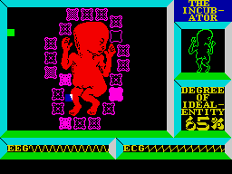

#+TITLE: Working (and living) with Generative AI
#+OPTIONS: ^:nil

#+begin_export html
    
        
<i>"Tell my wife I love her very much, she knows"</i>

#+end_export

#+CAPTION: Deus Ex Machina for the Spectrum. I never played it, but, at my second job, had a coworker that swore by it. I just never got ahold of the right cassette :( In any case, I think it's a good retro title to go with an always-under-construction page about working in the GenAI age.
#+ATTR_HTML: :width 100%

Published on 2026-07-21.
Updated on: 2026-07-22.

On this page I'll list the good, and bad things of working with GenAI.
I just want a central place I can point people to when this comes up in conversation.

*The good*

- I get more done. Sometimes *a lot* and, other times, just more. I'm measuring in results, which include usable software artifacts, or digital artifacts (documents, images, sounds, etc.), not lines of code, or amount of words.

- I get to discuss ideas with a responsive rubber duck, which can be quite helpful. The rubber duck is sometimes very wrong but, if you're aware of this, and keep your guard, that doesn't matter that much. What I mean by "keep your guard" is you must always validate what comes out of the ducks' mouth. How to do this isn't always easy, but nothing in life is.

- Exploring ideas is now super simple. I've done more prototyping (including hardware) in the last 12 months than in the previous 5 years, if not more. It is much easier now to explore an idea quickly to see if it's worth pursuing it more or not.

- Coding agents are very, and I mean *very* useful helpers when exploring a new codebase.

- I've found that the harness is typically more important (in terms of outcome quality) than the model.

- The best approach that works for me is usually: use the models to help me write more tools, but then eventually only use the deterministic tools when investigating or troubleshooting.

*The bad*

- There are days where the cognitive load feels too much to bear. I now need to stay on top of multiple lines of work at the same time, and my involvement is high-level. Yes, I do review all the code generated, but, at least to me, reading is not the same as writing. To truly *understand* how something works, I have to go and build it (or write it, or do it, whatever the metaphor is for the thing I am trying to understand). I'm more suitable for long-term, deep focus tasks, than to shor-term always-multitasking ones. I can do both, which is why I worked in Support and Incident Response, but I prefer deep work when possible, and these days, that's not always possible.

- It is very challenging to have a deep understanding of the things I build, when I'm building them by "choosing an architecture and directing an agent," to the point that I'm no longer doing that for personal projects. I still use coding agents for the exploratory phase, but then it's back to me writing things. Because I want to know how they work, and I want to be able to fix them whent they break (this is very similar to the previous point, but it is not the same problem).

- Related to the previous one, the models and agents are still not very good at troubleshooting. Sure, they can often produce convincing diagnostics, and they can often remove the visible effect of a software defect, but over 80% of the times I end up fixing problems myself. Models are super useful for the exploratory phase though.

- Some people act as if the rubber duck is alive and rarely, if ever, wrong. I can understand this, because I think our species doesn't have the epistemological training to deal with this new entities. A conversational user interface feels too much like you're talking to a fellow human. I think this is a more intense effect of what already happened before with, say, movies. I've met a lot of people who, even when knowing a certain movie is fiction, think the actions depicted on them are realistic.

- Some people just trust the output of code harnesses completely. Some even have other models (or even the same model with another prompt) review the code. If I'm signing off on something, *I'm* signing off on something. If a bot is doing that, fine. But I'm not hopping on a bot-reviewed airplane anytime soon.

- Local models are still too slow. One day they'll get there, but for now, I only use them to learn, but not to actually do things.

*Addendum: challenges*

- LLMs are usually too verbose. They can be used to summarize text, but the more you press in that direction, the higher the risk of missing or wrong information.
  Someone who solves the "Get a good, reliable summary of <something>" properly would hit it big.

- Models tend to not make that good use of visual information. In my work on bots, I've incorporated sparklines and inline graphics with reasonable success, but I'm still not where I'd    like to be (my goal is somewhere close to what Edward Tufte explains in The Visual Display of Quantitative Information).

- Agents can be, even within the same session, both very confident yet wrong, and very right yet quick to apologize and change course (to the wrong course).

#+begin_export html

<i>"This machine will not communicate these thoughts and the strain I am under."</i>

#+end_export
