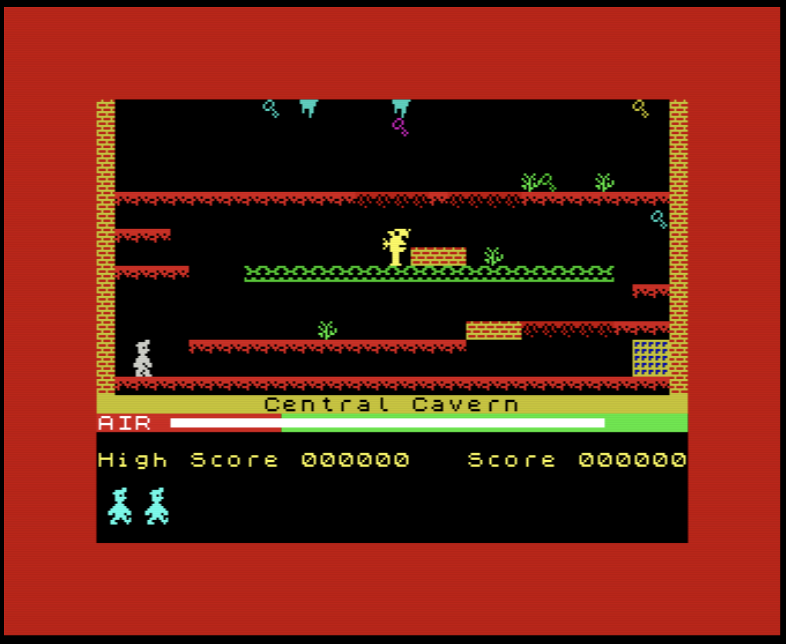

#+TITLE: A note to recruiters

#+begin_export html
    
        
<i>"Tell my wife I love her very much, she knows"</i>

#+end_export

#+CAPTION: DBAs are sometimes like the miners of the IT world, and Manic Miner was one of the best games in the 80s.
#+ATTR_HTML: :width 100%

Thank you for your interest, but I'm currently not looking for opportunities.

What if I have a great opporunity you say?

Well, if it's really great, do reach out, but please keep in mind that:
- I work from home. This is in Uruguay, so you should be able to somehow "hire" me there (the easiest way is not to hire me, but to buy services from my LLC instead).
- I don't like traveling without my family.
- For the forseable future, I'm not interested in relocating. It doesn't  matter where you are, really: I'm good where I am and I'm glad you are too!

Also consider that open positions that include a public salary range make the job market less unfair for some people, and saves everyone time.

#+begin_export html

<i>"I make a living, telling people what they want to hear. It's not a killing, but it's enough to keep the cobwebs clear"</i>

#+end_export

